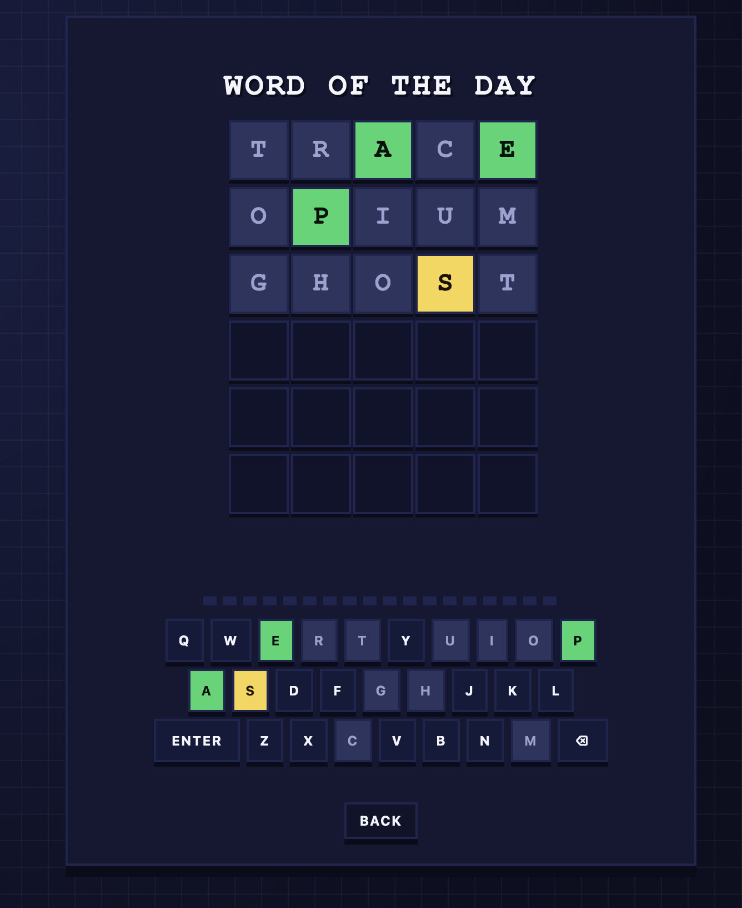
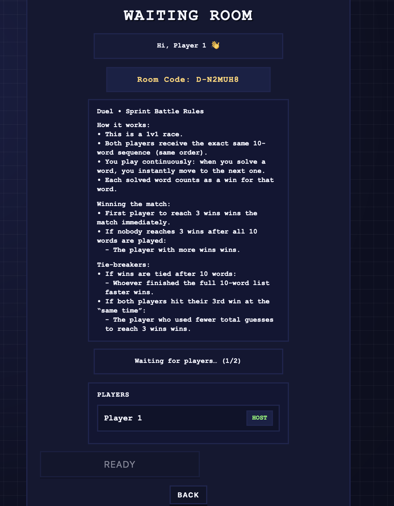
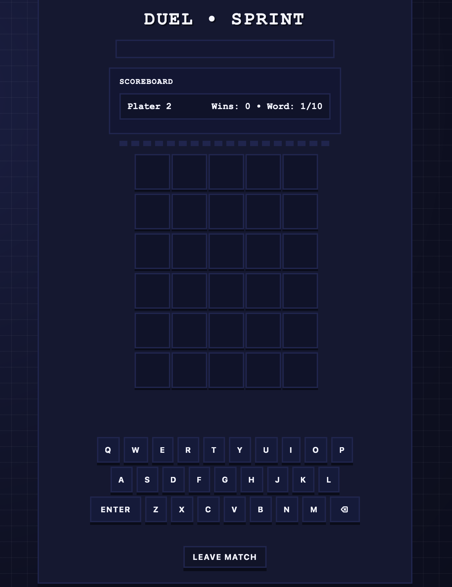

# Jumble

A real-time multiplayer word puzzle game where players attempt to guess hidden words within a limited number of attempts while receiving color-coded feedback on each guess.

The game includes both a daily single-player puzzle mode and a real-time multiplayer sprint mode, where players compete against each other in live matches.

Live Demo: https://jumble-55i1.onrender.com/

Note: The live demo is hosted on the Render free tier, so the server may take 30–60 seconds to start if inactive.

## Screenshots
### Single Player Mode

### Multiplayer Waiting Room

### Sprint Mode Gameplay

## Features
	•	Daily Word of the Day puzzle
	•	Real-time 1v1 multiplayer
	•	Private room creation and joining
	•	WebSocket-based live gameplay
	•	Backend guess validation system
	•	Color-coded feedback algorithm
	•	Dynamic game board updates

## Tech Stack

### Backend
	•	Python
	•	FastAPI
	•	WebSockets
	•	Uvicorn

### Frontend
	•	JavaScript
	•	HTML
	•	CSS

### Development Tools
	•	Git
	•	GitHub
	•	Python Virtual Environment (venv)

  ## Architecture

Jumble follows a client–server architecture.

Single-player gameplay uses REST APIs, where the frontend sends guesses to the backend for validation and evaluation.

Multiplayer gameplay uses WebSockets, allowing persistent communication between the server and connected players for real-time synchronization.

## Running Locally
#### 1. Clone the Repository
git clone https://github.com/zee-ap/Jumble.git
cd Jumble
#### 2. Create Virtual Environment
python -m venv venv
#### 3. Activate the virtual environment
source venv/bin/activate(Mac/Linux) or venv\Scripts\activate(Windows)
#### 4. Install Dependencies
pip install -r requirements.txt
#### 5. Start the Backend server
uvicorn app:app --reload
#### 6. Open the Frontend

## Author
### Zorawar Gill

Computer Engineering Student

University of Alberta
